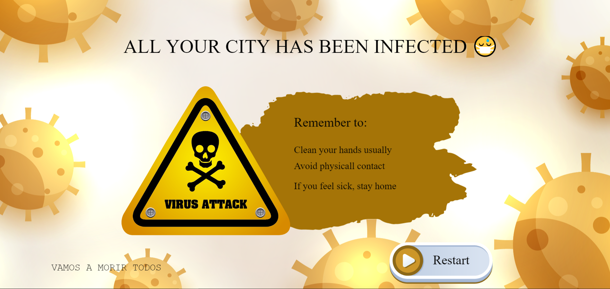

# StopTheCrown

 

  

 

## Devpost description of the project

### Inspiration

Our inspiration comes after we decided to create a procedural game, we were talking about it and suddenly we thing about papers please and the coronavirus, just because all the things that are happening in the world, we don't need to be always panic! We decide to create a game and have fun while we are also worried about the current situation that's happening in the world.

### What it does

StopTheCrown is a procedural game, based on Papers Please, where you are a customs police and you need to check that the passenger meets the rules to enter to the country and not infect the rest of the population.

### How we built it

We developed the game using Phaser.io, a game development framework for creating games using JS, and node.js.

### Challenges we ran into

The procedural part, at the beginning we didn't see any idea that can be a procedural game. Then we decide to game with *Papers please* style but procedural and after a lot of discussions and time, we can get it!

### Accomplishments that we're proud of

It was the first time using the framework. In other hackathons, we try it but we change all the code, in this hackathon, we use the framework with all the recommended methodology, in the beginning, it was a bit hard for the design but at the end, we are proud of how it looks.

### What we learned

We learned how to use the framework and also to create a procedural game, we didn't know anything about it.

### What's next for Stop the crown

In the next steps we can add more rules and more levels... or also make it more procedural too!!

## Screenshoots

Our game have only one screen were you need to interact.
 

  

 

##### Losing screen

 

  

 

##### Wining screen

 

  

 